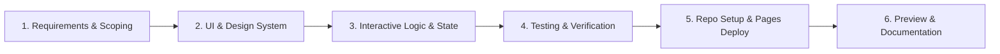

# Personal Hub • Live Clock & Profile

An aesthetic, responsive personal landing page featuring a real-time precision digital clock, dynamic time-of-day greetings, interactive color themes, and an editable personal profile.

🔗 **Live Demo**: [https://richard5007.github.io/0916/](https://richard5007.github.io/0916/)

## ✨ Features

- **Precision Live Digital Clock**: Real-time display of hours, minutes, and seconds with smooth animations.
- **12H / 24H Toggle & Time Copy**: Easily switch between standard and military time formats, with a one-click clipboard copy function.
- **Dynamic Greetings**: Time-aware greeting adapting throughout the day (Morning, Afternoon, Evening, Night).
- **Personalized Profile Card**:
  - In-place click-to-edit name with automatic monogram initials generation.
  - Persistent state saved locally in browser `localStorage`.
- **Year Progress & Day Stats**: Live calculation of the percentage of the current year elapsed, day of year, week number, and day of week.
- **Curated Themes**: Includes *Cosmic Dark*, *Aurora Emerald*, and *Nebula Sunset* themes with ambient glowing backgrounds.
- **Inspirational Quotes**: Refreshable quote card featuring famous perspectives on time and productivity.

## 🚀 Getting Started

1. Clone or download this repository.
2. Open `index.html` directly in any modern web browser.
3. No build step or dependencies required! Pure HTML, CSS, and Vanilla JavaScript.

## 🛠️ Built With

- **HTML5**: Semantic document structure.
- **CSS3**: Custom properties, glassmorphism, responsive grid & flexbox, keyframe animations.
- **JavaScript (ES6+)**: Real-time interval engine, local storage integration, clipboard API.
- **Google Fonts**: [Outfit](https://fonts.google.com/specimen/Outfit), [Inter](https://fonts.google.com/specimen/Inter), and [JetBrains Mono](https://fonts.google.com/specimen/JetBrains+Mono).

## 🔄 Development Workflow

This project was developed and deployed using a modern, iterative AI Pair Programming and pure frontend engineering workflow:

1. **Requirements & Architecture Planning**
   - Defined project objectives: Create a high-aesthetic, responsive personal hub featuring a live precision clock, time-aware greetings, customizable name badge, and year progress tracking.
   - Selected tech stack: Pure Vanilla HTML5, CSS3, and ES6+ JavaScript. Completely zero-build, zero-dependency, and instantly runnable in any browser.

2. **Design System & Glassmorphism UI**
   - Imported curated typography via Google Fonts (`Outfit` for headings, `Inter` for body text, `JetBrains Mono` for tabular clock digits).
   - Engineered multi-layered floating ambient glow animations and sleek frosted glassmorphism card surfaces.
   - Implemented a unified CSS variable design system featuring 3 vibrant themes (*Cosmic Dark*, *Aurora Emerald*, and *Nebula Sunset*).

3. **Interactive Logic & State Management**
   - **Precision Clock Engine**: Real-time interval synchronization with zero drift, featuring standard 12H/24H format toggling and one-click clipboard copying.
   - **Dynamic Greeting**: Time-of-day awareness generating tailored greetings and emojis (Morning, Afternoon, Evening, Night).
   - **Customizable Profile Card**: In-place click-to-edit name input, real-time monogram initials avatar generator, and persistent `localStorage` memory.
   - **Year Progress & Metrics**: Live mathematical calculation of annual percentage elapsed, day of the year, week number, and day of week.
   - **Inspirational Quotes**: On-demand rotating quote card with famous perspectives on time management and focus.

4. **Version Control & Deployment**
   - Structured Git version control with clean commit history.
   - Renamed repository to `0916` and synchronized the remote `origin` configuration.
   - Deployed live to GitHub Pages at [https://richard5007.github.io/0916/](https://richard5007.github.io/0916/).
   - Captured high-resolution UI preview (`image.png`) and completed documentation.

## 📄 License

MIT License. Feel free to use, modify, and distribute for your own personal portfolio!

