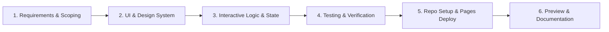

# 許景翔 (Richard Hsu) • Personal Page & Live Dashboard

An aesthetic, responsive personal landing page and portfolio designed for the **Graduate Institute of Computer Science and Information Engineering (資訊工程研究所)**. Features a real-time precision digital clock, dynamic time-aware greetings, tech skills inventory, featured projects showcase, and interactive themes.

🔗 **Live Demo**: [https://richard5007.github.io/0916/](https://richard5007.github.io/0916/)  
📁 **GitHub Repository**: [https://github.com/Richard5007/0916](https://github.com/Richard5007/0916)


---

## 📌 Assignment Requirements Checklist

This project fulfills all 5 core requirements of the Personal Page assignment:

| # | Requirement | Implementation Details |
|---|---|---|
| **1** | **👤 Profile** | **許景翔 (Richard Hsu)**, **資訊工程研究所 (Graduate Institute of CSIE)**. Includes stylized monogram avatar badge (`RH`), bio, and specialization tags (ML, Systems, Vision). |
| **2** | **🛠 Skills** | Comprehensive categorized skills matrix: **Python**, **C / C++**, **JavaScript**, **Machine Learning**, **PyTorch**, **OpenCV**, **Linux**, **Git/GitHub**, and **Docker**. |
| **3** | **🚀 Projects** | Showcases 3 engineering projects: **0916 Personal Hub** (Featured with live link), **Edge-AI Real-Time Vision Pipeline**, and **Distributed Task Scheduler**. |
| **4** | **🕐 Live Clock** | Precision real-time JavaScript digital clock (`HH : MM : SS`) with live second-by-second updates, standard 12H/24H toggle, and one-click time copy. |
| **5** | **🎨 Personal Design** | Custom frosted glassmorphism UI, ambient radial light animations, Google Fonts (`Outfit`, `Inter`, `JetBrains Mono`), responsive layouts, and 3 themes (*Cosmic Dark*, *Aurora Emerald*, *Nebula Sunset*). |

---

## ✨ Key Features

- **Precision Live Digital Clock**: Real-time display of hours, minutes, and seconds with zero drift and smooth glowing separator animation.
- **12H / 24H Toggle & Clipboard Copy**: Easily switch between standard (AM/PM) and 24-hour military time, with one-click clipboard copying.
- **Dynamic Time-Aware Greetings**: Contextual greetings that adjust throughout the day (`Good Morning 🌅`, `Good Afternoon ⚡`, `Good Evening 🌆`, `Good Night 🌌`).
- **Interactive Profile Name Editor**: Click-to-edit name with automatic monogram initials generation and browser `localStorage` persistence.
- **Year Progress & Metrics**: Live mathematical calculation of annual percentage elapsed, day of the year, week number, and day of week.
- **Curated Theme Switcher**: Instant switching between *Cosmic Dark*, *Aurora Emerald*, and *Nebula Sunset* themes.
- **Inspirational Quotes Carousel**: Refreshable quote widget featuring perspectives on time management and productivity.

---

## 🛠️ Built With

- **HTML5**: Semantic document structure and accessible elements.
- **CSS3 (Vanilla)**: Custom design tokens, glassmorphism backdrop-filters, responsive CSS grid & flexbox, floating ambient keyframe animations.
- **JavaScript (ES6+)**: Real-time interval engine, client-side state management (`localStorage`), clipboard API.
- **Google Fonts**: [Outfit](https://fonts.google.com/specimen/Outfit), [Inter](https://fonts.google.com/specimen/Inter), and [JetBrains Mono](https://fonts.google.com/specimen/JetBrains+Mono).

---

## 🔄 Development Workflow

This project was built and deployed following the complete development lifecycle:
**Idea → AI Build → Test → GitHub → Publish**



1. **Requirements & Architecture Planning**
   - Established design objectives for a CS graduate student personal page (許景翔 • 資訊工程研究所).
   - Chose pure native web technologies (HTML5 + CSS3 + ES6+ JavaScript) for zero-build, zero-dependency instant execution.

2. **Design System & Glassmorphism UI**
   - Crafted a multi-layered ambient radial glow background and frosted glassmorphism cards.
   - Built a flexible CSS variable system supporting multiple dark-mode themes.

3. **Interactive Logic & State Management**
   - Real-time precision clock with 12H/24H mode toggle and copy function.
   - Time-of-day greeting engine and editable name badge with local storage persistence.
   - Categorized skills cards with proficiency progress indicators and project showcase grid.

4. **Version Control & GitHub Pages Deployment**
   - Initialized structured Git version control and committed repository files.
   - Configured repository name to `0916` and connected remote origin.
   - Enabled GitHub Pages hosting for instant global deployment at [https://richard5007.github.io/0916/](https://richard5007.github.io/0916/).
   - Integrated UI preview screenshot (`image.png`) and comprehensive documentation.

---

## 🚀 Getting Started Locally

1. Clone this repository:
   ```bash
   git clone https://github.com/Richard5007/0916.git
   ```
2. Open `index.html` directly in any modern web browser.
3. No build tools, Node modules, or package managers required!

---

## 📄 License

MIT License. Free to use, modify, and distribute for personal portfolios and academic submissions.
