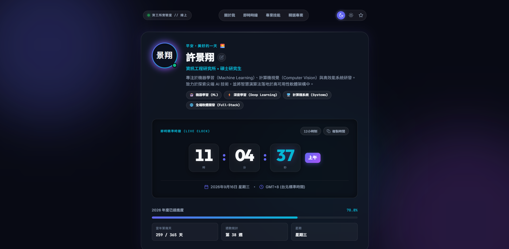
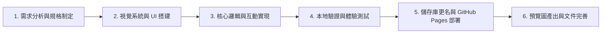

# Personal Hub • Live Clock & Profile

An aesthetic, responsive personal landing page featuring a real-time precision digital clock, dynamic time-of-day greetings, interactive color themes, and an editable personal profile.

🔗 **Live Demo**: [https://richard5007.github.io/0916/](https://richard5007.github.io/0916/)

## ✨ Features

- **Precision Live Digital Clock**: Real-time display of hours, minutes, and seconds with smooth animations.
- **12H / 24H Toggle & Time Copy**: Easily switch between standard and military time formats, with a one-click clipboard copy function.
- **Dynamic Greetings**: Time-aware greeting adapting throughout the day (Morning, Afternoon, Evening, Night).
- **Personalized Profile Card**:
  - In-place click-to-edit name with automatic monogram initials generation.
  - Persistent state saved locally in browser `localStorage`.
- **Year Progress & Day Stats**: Live calculation of the percentage of the current year elapsed, day of year, week number, and day of week.
- **Curated Themes**: Includes *Cosmic Dark*, *Aurora Emerald*, and *Nebula Sunset* themes with ambient glowing backgrounds.
- **Inspirational Quotes**: Refreshable quote card featuring famous perspectives on time and productivity.

## 🚀 Getting Started

1. Clone or download this repository.
2. Open `index.html` directly in any modern web browser.
3. No build step or dependencies required! Pure HTML, CSS, and Vanilla JavaScript.

## 🛠️ Built With

- **HTML5**: Semantic document structure.
- **CSS3**: Custom properties, glassmorphism, responsive grid & flexbox, keyframe animations.
- **JavaScript (ES6+)**: Real-time interval engine, local storage integration, clipboard API.
- **Google Fonts**: [Outfit](https://fonts.google.com/specimen/Outfit), [Inter](https://fonts.google.com/specimen/Inter), and [JetBrains Mono](https://fonts.google.com/specimen/JetBrains+Mono).

## 🔄 開發工作流 (Development Workflow)

本專案採用現代、漸進式的 AI Pair Programming 與純前端工程工作流完成：

1. **需求分析與規劃 (Requirements & Architecture Planning)**
   - 確立專案目標：打造極具現代感與視覺質感的個人首頁，具備即時動態時鐘、時間感知問候語、可自訂姓名名牌與年度進度條。
   - 技術架構選型：純原生 HTML5 + Vanilla CSS3 + ES6+ JavaScript，免打包工具（Zero-build）、零相依（Zero-dependency），開箱即用。

2. **設計系統與毛玻璃 UI 建構 (Design System & Glassmorphism UI)**
   - 導入 Google Fonts（標題 `Outfit`、內文 `Inter`、等寬數字 `JetBrains Mono`）。
   - 設計多層次流動環境光暈（Ambient Radial Glow）與毛玻璃擬物卡片（Glassmorphism）。
   - 建立 CSS 變數設計系統，提供三款主題切換（Cosmic Dark / Aurora Emerald / Nebula Sunset）。

3. **動態邏輯與互動開發 (Interactive Logic & State Management)**
   - **精準時鐘引擎**：`setInterval` 搭配原生 `Date` 物件精準計算時、分、秒，支援 12/24 小時制切換與剪貼簿一鍵複製。
   - **時間感知問候**：依據使用者的本地時間（早晨、午後、傍晚、深夜）動態產生個性化問候與 Emoji。
   - **可編輯個人名牌**：支援原地點擊編輯姓名，即時重新計算縮寫頭像（Monogram Initials），並存入瀏覽器 `localStorage` 實現跨工作階段記憶。
   - **年度進度與時曆統計**：即時計算當年度已過百分比進度條、當年第幾天、第幾週。
   - **靈感語錄輪播**：點擊按鈕隨機輪換時間與生產力名言。

4. **版本控制與部署發布 (Version Control & GitHub Pages Deployment)**
   - 進行 Git 版本控制與結構化提交。
   - 儲存庫規範化重命名為 `0916`，同步更新本地 `remote origin` 連結。
   - 啟用 GitHub Pages 靜態網站託管，將成果即時公開發布。
   - 截取頁面視覺預覽圖（`image.png`）並整合進 README，完成完整文件交付。

## 📄 License

MIT License. Feel free to use, modify, and distribute for your own personal portfolio!

