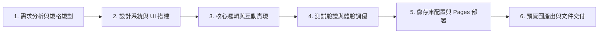

# 許景翔 • 個人主頁 & 即時時鐘儀表板 (Personal Hub)

這是一個專為**資訊工程研究所**打造的高質感、響應式個人主頁與作品展示中心。具備即時高精度數位時鐘、時段智慧問候、核心技能庫、精選專案展示以及多套現代毛玻璃（Glassmorphism）動態光暈主題。

🔗 **線上展示網址 (Live Demo)**：[https://richard5007.github.io/0916/](https://richard5007.github.io/0916/)  
📁 **GitHub 專案原始碼**：[https://github.com/Richard5007/0916](https://github.com/Richard5007/0916)


---

## 📌 作業 5 大項目完成檢核表

本專案完整落實作業所規範之 5 大核心指標：

| 項次 | 作業指標要求 | 具體實現與技術特色 |
|:---:|:---|:---|
| **1** | **👤 個人簡介 (Profile)** | • 姓名：**許景翔 (Richard Hsu)**<br>• 科系：**資訊工程研究所 (Graduate Institute of CSIE)**<br>• 頭像：發光環動態縮寫頭像（`景翔`），支援原地點擊修改姓名與 `localStorage` 離線儲存記憶<br>• 專長標籤：機器學習、深度學習、計算機系統、全端開發<br>• 個人自介：專注於高效能 AI 演算法與分散式架構研發 |
| **2** | **🛠 專業技能 (Skills)** | 結構化歸類為三大核心領域並提供可視化熟練度進度條：<br>1. **程式語言**：Python (精通)、C / C++ (熟練)、JavaScript ES6+ (熟練)<br>2. **AI 與資料科學**：機器學習 (精通)、PyTorch 深度學習 (熟練)、電腦視覺 OpenCV (熟練)<br>3. **系統與軟體工程**：Linux 系統與 Shell 腳本、Git & GitHub 工作流、Docker 容器化架構 |
| **3** | **🚀 專案成果 (Projects)** | 完整展示 3 項資工實務專案（含名稱、描述、技術標籤與連結）：<br>1. **0916 個人專屬主頁 & 即時儀表板**（主打專案，附線上展示與 GitHub 連結）<br>2. **Edge-AI 邊緣端即時影像辨識系統**（PyTorch, OpenCV, ONNX Runtime）<br>3. **分散式非同步任務排程與即時監控**（C++, Python, Docker, WebSocket） |
| **4** | **🕐 即時時鐘 (Live Clock)** | **原生 JavaScript 高精度數位時鐘**：<br>• 每秒即時動態更新（`時 : 分 : 秒`）<br>• 支援 12H / 24H 制即時切換與「上午 / 下午」標籤<br>• 提供「一鍵複製目前時間」至剪貼簿功能<br>• 包含中文完整年月日、星期、在地時區（GMT+8 台北標準時間）與 2026 年度已過進度百分比條 |
| **5** | **🎨 個人化設計 (Design)** | • **現代視覺體系**：整合 Google Fonts（`Outfit`、`Inter`、`JetBrains Mono`、`Noto Sans TC`）<br>• **動態美學**：多層流動環境光暈（Ambient Radial Glow）搭配深層毛玻璃擬物卡片（Glassmorphism）<br>• **主題切換器**：內建「深邃夜空」、「翡翠極光」、「暮色星雲」3 套配色主題<br>• **完全自適應**：針對行動裝置、平板與電腦進行多斷點 RWD 響應式佈局最佳化 |

---

## ✨ 核心特色與亮點

- **零延遲高精度時鐘**：透過原生 `setInterval` 與 `Date` 物件精準運算，時鐘冒號具備柔和呼吸燈動態。
- **12H / 24H 雙制式與時間複製**：自由切換標準 12 小時制或 24 小時制，點擊複製按鈕即刻將格式化時間寫入剪貼簿。
- **時段智慧感知問候**：隨系統時間自適應切換（`早安，美好的一天 🌅`、`午安，持續專注前進 ⚡`、`傍晚好，享受愜意時光 🌆`、`夜深了，注意休息與沉澱 🌌`）。
- **原地修改姓名與資料記憶**：點擊姓名或編輯圖示即可原地修改顯示名稱，自動重新計算縮寫頭像，並儲存於瀏覽器 `localStorage`。
- **2026 年度進度條與日曆數據**：即時計算當年度已過時間比例（%）、當年累積第幾天與第幾週。
- **經典靈感名言輪播**：收錄時間管理與專注思維名言，支援點擊即時輪換。

---

## 🛠️ 開發技術棧

- **結構 (HTML5)**：語意化標籤架構、無障礙屬性（ARIA labels）。
- **樣式 (Vanilla CSS3)**：CSS 變數系統、毛玻璃濾鏡（`backdrop-filter`）、CSS Grid 與 Flexbox 響應式排版、Keyframe 流動光暈動畫。
- **邏輯 (JavaScript ES6+)**：即時時鐘計算引擎、時間與日曆數學轉換、Clipboard API、`localStorage` 本地記憶。
- **字型 (Google Fonts)**：[Outfit](https://fonts.google.com/specimen/Outfit)、[Inter](https://fonts.google.com/specimen/Inter)、[JetBrains Mono](https://fonts.google.com/specimen/JetBrains+Mono) 與 [思源黑體 (Noto Sans TC)](https://fonts.google.com/specimen/Noto+Sans+TC)。

---

## 🔄 完整開發工作流 (Development Workflow)

本專案遵循完整的現代軟體工程開發與部署生命週期：  
**發想 (Idea) ➔ AI 協作建構 (AI Build) ➔ 測試驗證 (Test) ➔ Git 版本控制 (GitHub) ➔ 發布上線 (Publish)**



1. **需求分析與規格規劃 (Requirements & Architecture Planning)**
   - 確立以資訊工程研究所研究生個人首頁為核心主題，涵蓋 Profile、Skills、Projects、Live Clock、Design 5 大要素。
   - 選用純原生 HTML5 + CSS3 + ES6+ JavaScript，免打包工具（Zero-build）、零第三方依賴（Zero-dependency），開啟即可執行。

2. **設計系統與毛玻璃 UI 搭建 (Design System & Glassmorphism UI)**
   - 導入現代雙語排版字型，設計多層次流動發光背景球與高質感毛玻璃卡片。
   - 建立全域 CSS 變數設計系統，提供 3 套主題無縫切換體驗。

3. **核心邏輯與互動實現 (Interactive Logic & State Management)**
   - 撰寫無漂移的即時時鐘引擎，支援格式切換、剪貼簿複製與時段感知問候。
   - 實作姓名原地編輯與自動生成中文雙字縮寫頭像，儲存於 `localStorage`。
   - 製作技能分類卡片、熟練度進度條與精選專案矩陣。

4. **版本控制與發布上線 (Version Control & GitHub Pages Deployment)**
   - 建立結構化 Git 提交紀錄。
   - 儲存庫規範化命名為 `0916`，同步更新本地 remote 位址。
   - 啟用 GitHub Pages 靜態網站託管，部署至 [https://richard5007.github.io/0916/](https://richard5007.github.io/0916/)。
   - 擷取頁面高解析度預覽圖（`image.png`）並完成全中文專業文件交付。

---

## 🚀 本地快速啟動

1. 複製本專案儲存庫：
   ```bash
   git clone https://github.com/Richard5007/0916.git
   ```
2. 直接使用任何現代瀏覽器點開 `index.html`。
3. 無須安裝 Node.js、無須執行 `npm install` 或 build 指令，開箱即用！

---

## 📄 授權條款 (License)

MIT License. 歡迎自由參考、修改與作為個人專案展示使用。
